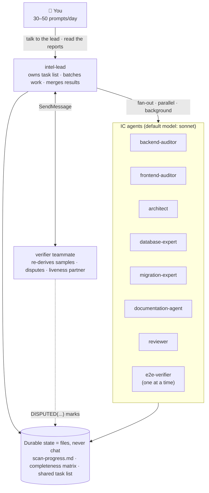

# Multi-Agent App Builder

A portable Claude Code agent-team kit. Drop it into any repository to get:

1. **A project brain** — a validated `.ai/` knowledge base reverse-engineered from the
   code, every claim carrying `file:line` evidence.
2. **A completeness audit** — frontend ↔ backend, requirement by requirement, with
   verdicts (`IMPLEMENTED / PARTIAL / STUB / MISSING / UNREACHABLE`) and a ranked gap
   report that tells you where the application actually stands.
3. **A build crew** — specialist roles (architect, engineers, reviewer, …) and slash
   commands that implement features *the repo's way* afterwards, keeping the brain
   up to date.

Extracted from a real production run on a multi-tenant SaaS and genericized; the
failure modes that run exposed are baked into the charter as standing rules.

## Quick start

```bash
git clone git@github.com:mjalbanna/multi-agent-app-builder.git
```

```bash
./multi-agent-app-builder/install.sh /path/to/your-repo
```

Then fill `.claude/team/project-profile.md` — the **single adaptation point**:
everything the agents must know about *this* project (stack, commands, invariants,
data safety) lives there. Don't do it by hand — have Claude fill it from evidence:
open a Claude Code session in the target repo (plain `claude`) and paste this
prompt:

```text
Fill in .claude/team/project-profile.md for this repository from evidence, not guesses. Read the template's sections, then investigate the repo: package manifests and lockfiles for the stack and versions; scripts and CI config for the real dev/build/test/lint commands and the directory they run from; the layout for where business logic, routes and schema live; README/docs/specs/issues for requirement sources and any existing backlog; the code for the canonical mutation pattern (cite one real example file) and recurring invariants; env samples, DB config and migration setup for the Data safety section. Rules: cite a file path for every field you fill; prefix every inferred value with AUTO; write UNKNOWN where evidence is genuinely absent — never guess. Data safety is special: if you cannot PROVE local dev uses an isolated datastore, write that all datastores must be treated as production. Modify ONLY .claude/team/project-profile.md. Finish by printing the completed profile plus the short list of questions only a human can answer (which environment local dev really points to, anything that must never be triggered) so I can confirm or correct them.
```

Review what it wrote — especially the **Data safety** section, the one part worth
a human's minute — correct anything wrong, then launch the lead (all prompts also
live in `.claude/team/kickoff.md`):

```bash
claude --permission-mode acceptEdits "You are intel-lead. Read .claude/team/project-profile.md and .claude/team/charter-project-intelligence.md, then execute the charter: create the shared task list from its workstreams, spawn the verifier teammate, and begin with W0."
```

## Architecture



- **One team per repository.** To run several projects, install the kit in each and
  launch one lead per repo — sessions on the same machine can list and message each
  other (`ListAgents` / `SendMessage`) regardless of folder, which is how a top-level
  session can query every project lead.
- Any agent can be killed and restarted at any time; the charter requires that all
  progress be resumable from the files alone.

## What's in the box

| Path | Installs to | Purpose |
|---|---|---|
| `agents/` (11 roles) | `.claude/agents/` | qa-lead, backend/frontend-auditor, e2e-verifier, architect, backend/frontend-engineer, database-expert, migration-expert, reviewer, documentation-agent |
| `commands/` (5) | `.claude/commands/` | `/analyze-project`, `/implement-feature`, `/review-code`, `/update-knowledge`, `/analyze-migration` |
| `team/charter-project-intelligence.md` | `.claude/team/` | The mission: workstreams W0–W11 |
| `team/project-profile.template.md` | `.claude/team/project-profile.md` | The adaptation point (never overwritten by the installer) |
| `team/kickoff.md` | `.claude/team/` | Launch/resume/audit-only prompts + monitoring cheatsheet |
| `team/watchdog.sh` | `.claude/team/` | Optional outer safety net (cron + tmux) |
| `ai/README.md` | `.ai/README.md` | The knowledge-base rulebook |
| `settings/settings.snippet.json` | merged into `.claude/settings.json` | Enables agent teams (`CLAUDE_CODE_EXPERIMENTAL_AGENT_TEAMS=1`, `teammateMode: auto`) |

Requirements: Claude Code ≥ 2.1.224 (cross-session messaging), the agent-teams
experimental flag (installer adds it), `tmux` optional but recommended on macOS.

## Monitoring

- Talk to the lead's pane — asking "status?" never breaks the run.
- Teammates appear as tmux split panes (`teammateMode: auto`); subagents render
  inline in the lead's transcript; the shared task list shows who claimed what.
- `tail -f .ai/reports/scan-progress.md` for the durable log;
  `.claude/team/heartbeats/` mtimes for liveness; `/usage` in the lead pane for cost.
- From any other session: ask it to "list agents", then message the lead by name.

## Models

Every role ships with **`model: sonnet`** in its frontmatter, so the IC fleet runs
on Sonnet regardless of what the lead session uses. To change a role's model, edit
the `model:` line at the top of its file — `agents/<role>.md` in this kit, or
`.claude/agents/<role>.md` in a repo you've already installed into (the installer
never overwrites existing files without `--force`). Valid values: `sonnet`,
`opus`, `haiku`, a full model id, or `inherit` to follow the lead session. The
lead and the verifier teammate are sessions, not agent files — set their model at
launch with `claude --model …`. Worth the upgrade: `reviewer` does the
adversarial verification, and a wrong CONFIRMED verdict costs more than the
tokens Sonnet saves — consider `model: opus` there. Expect a full W0–W11 run on a mid-size
repo to take hours and millions of tokens; scale the charter's scope down if that
stings.

## Lessons baked in (from the original run)

- The adversarial verifier raised 6 disputes; **all 6 were upheld**, two against the
  lead's own writing. The verify pass is not optional ceremony.
- Counting claims ("41 feature keys", "64 endpoints") were wrong four times across
  different agents — the charter requires two independent derivations before a count
  is recorded.
- One agent contradicted a fact an earlier agent had cited correctly, and the lead
  propagated the error — new claims are cross-checked against the KB, not only code.
- Stubs look real end-to-end: a provider that returns success makes every dashboard
  say "Sent". Agents must read bodies, not names, and follow success statuses to
  their source.
- Test teardown is code too: two suites passed for months while leaking fixture rows
  into a shared database.
